# MC-三菱MELSEC-以太网 通讯协议基础
## 报文类型及用途
|代码类型|数据量|数据存储顺序
|----|----|----
|ASCII|X|顺序存储
|二进制|X/2|倒序存储

|数据帧类型|特点及用途|有兼容性的报文格式|对应代码
|--------|---------|:--------------:|------
|4E帧|3E帧+序列号组成|SLMP报文格式|ASCII代码<br>二进制代码
|3E帧|常用格式|SLMP报文格式<br>MELSEC-QnA系列以太网接口模块报文格式|ASCII代码<br>二进制代码
|1E帧|---|MELSEC-A系列以太网接口模块报文格式|ASCII代码<br>二进制代码

## 报文格式 以3E帧为例
 - 请求报文格式
   ```html
      帧头:副帧头:访问路径:数据长:监视定时器:请求数据
   ```
 - 响应报文格式(正常结束:有数据)
   ```html
      帧头:副帧头:访问路径:数据长:结束代码:响应数据
   ```
 - 响应报文格式(正常结束:无数据)
   ```html
      帧头:副帧头:访问路径:数据长:结束代码
   ```
 - 响应报文格式(异常结束)
   ```html
      帧头:副帧头:访问路径:数据长:结束代码:出错信息
   ```
## 举例说明:

 - #### 以3E帧二进制向软元件7000,写入值000C
    ```shell 
        发送帧内容: 50 00 00 FF FF 03 00 0E 00 10 00 01 14 00 00 58 1B 00 A8 01 00 0C 00
        响应帧内容: D0 00 00 FF FF 03 00 02 00 00 00 
    ```
    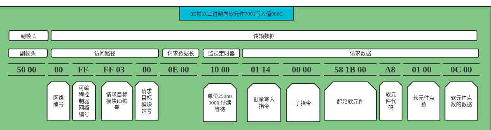
    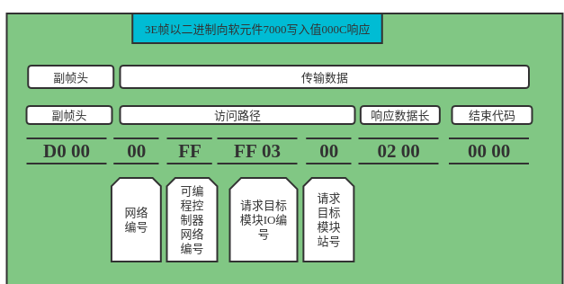
 - #### 以3E帧二进制读取软元件7000开始的连续5个软元件的值
     ```shell 
         发送帧内容: 50 00 00 FF FF 03 00 0C 00 10 00 01 04 00 00 58 1B 00 A8 05 00
         响应帧内容: D0 00 00 FF FF 03 00 0C 00 00 00 0C 00 00 00 00 00 00 00 00 00 
     ```
    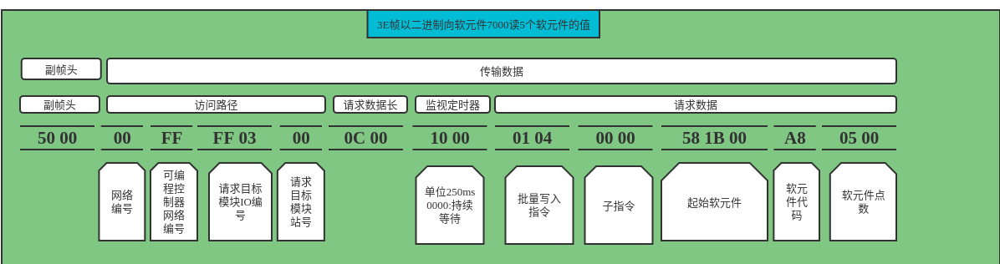
    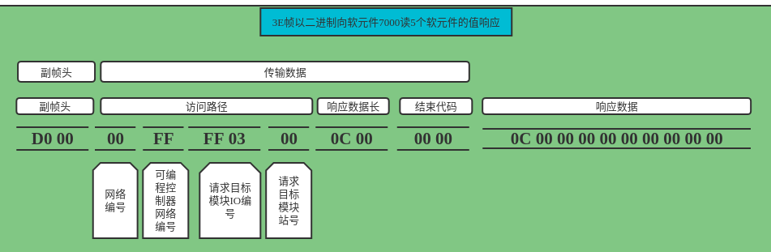
    
##  数据详细内容

   - 副帧头  
   ```shell script
    根据报文类型设置定义
      - 4E帧:固定值(请求:"5400",响应:"D400")+系列号(0000H-FFFFH)+空余 
      - 3E帧:固定值(请求"5000",响应"D000")
  ```
   - 访问路径
        ```5字节长来描述访问站信息```
        - 网络编号
            ```
            默认为00,范围是01~EF,后面的不可访问  
          ```
        - 可编程控制器网络编号
            ```shell script
            访问单点和多点链接站的情况下为FF
            使用联通请求功能的情况下为FE
            ```
        - 请求目标模块IO编号
            ```默认03 FF``` 
        - 请求目标模块站号
             ```默认00``` 
        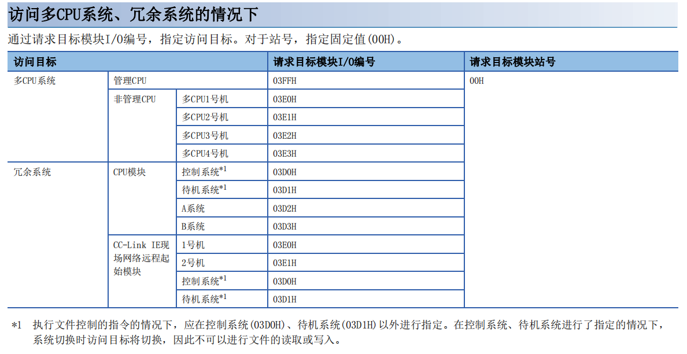       

        
   - 数据长
        ```shell
        以2字节显示,后面数据长度
        ```
   - 监视定时器
        ```shell script
         向目标发出处理请求到返回响应为止的等待时间
                 - 0000H(0):无限等待
                 - 0001H~FFFFH(1~65535):等待时间(单位250ms)
                 - 正常通信设定范围
                 
                 |访问目标|监视定时器
                 |------|--------
                 |本站|0001H~0028H(0.25~10秒)
                 |其他站|0002H~00F0H(0.5~60秒)
        ```
   - 请求数据
        - 指令,子指令
        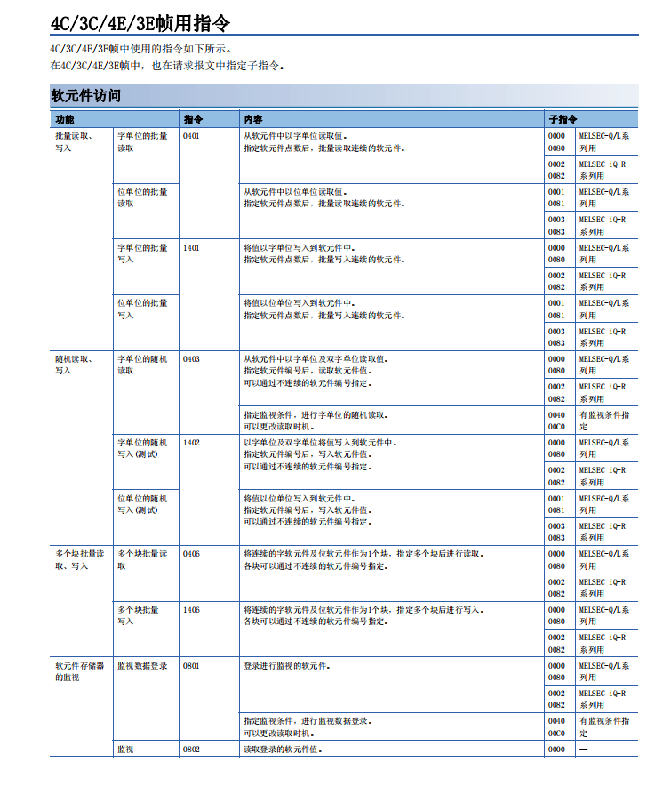
        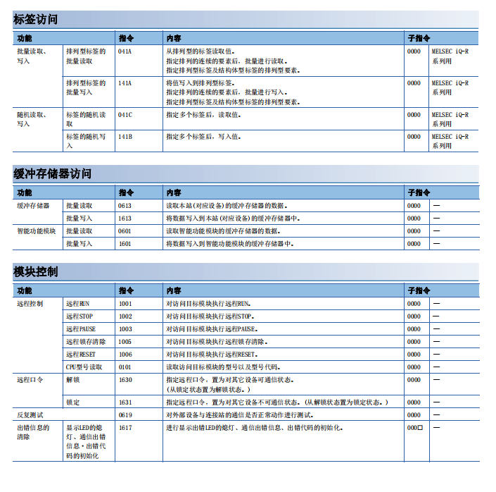
        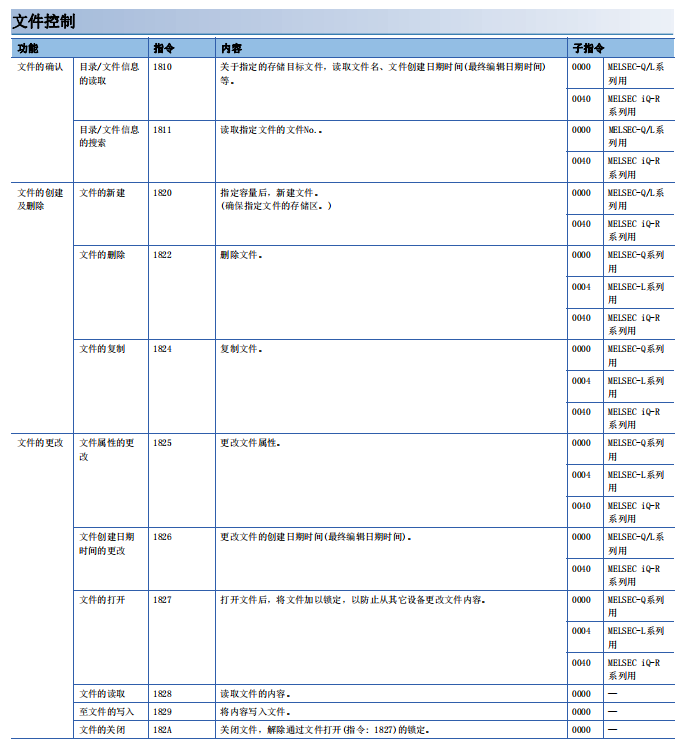
        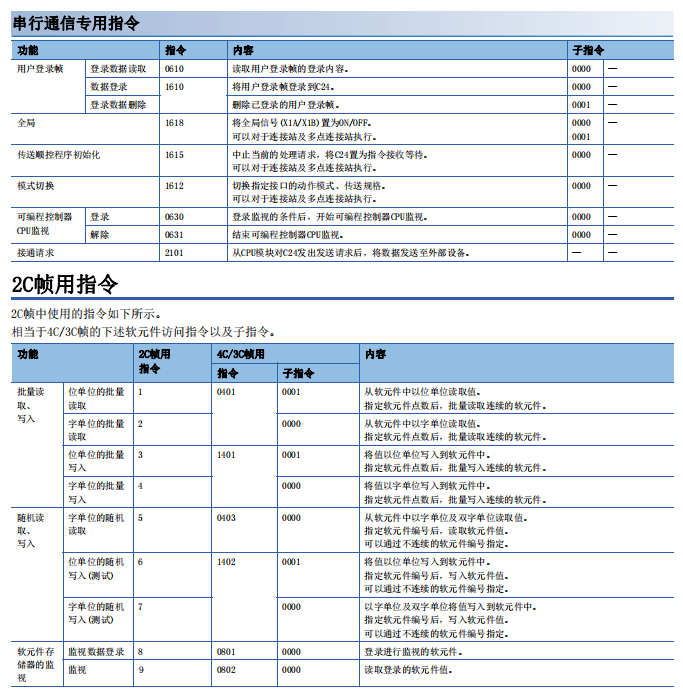
        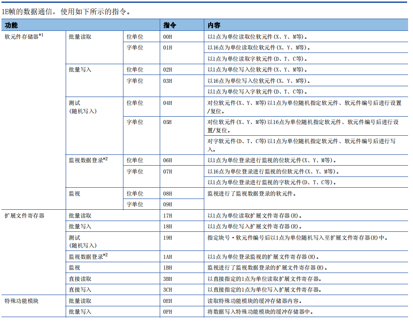
        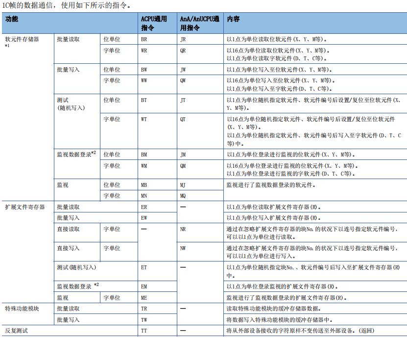
        - 起始软元件
            ```起始读取或写入的标识符``` 
        - 软元件代码
        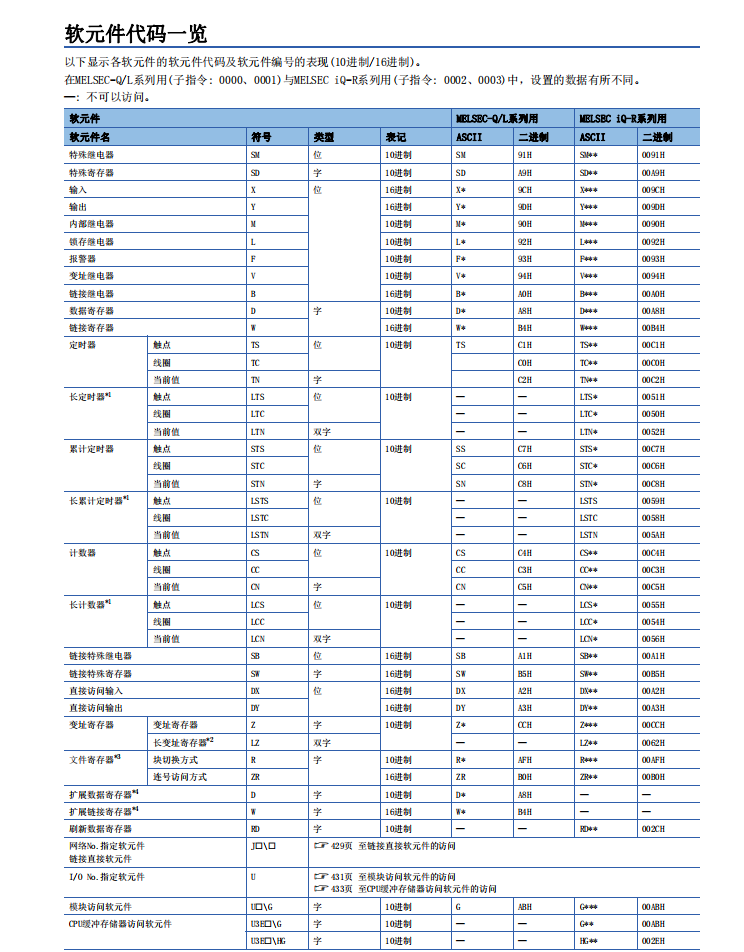
        - 软元件点数
            ```2字节,表示响应数据位长=点数*2,如点数为1响应数据位长为2,点数为2响应数据位长为4```
        - 软元件点数的数据
   - 结束代码
        ```shell script
         正常结束返回0000,异常结束返回结束错误码
        ```
   - 响应数据
        ```其位长由软元件点数决定```
   - 出错信息
        ```shell script
         出错信息由三部分组成:访问路径+指令+子指令
        ``` 
        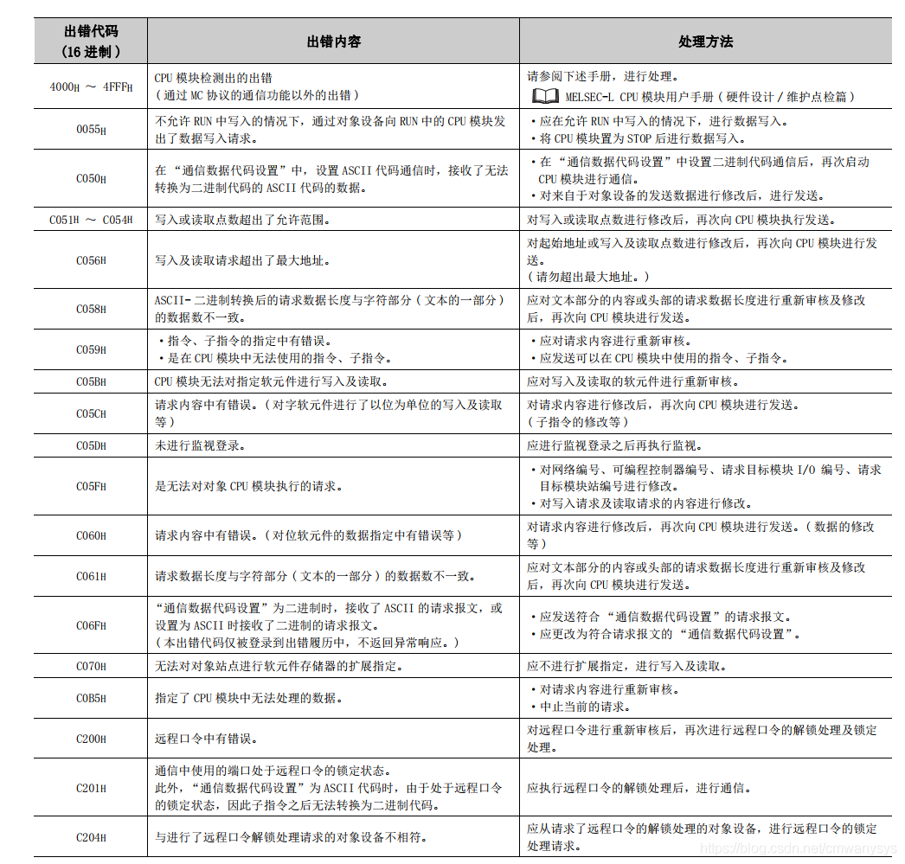
   